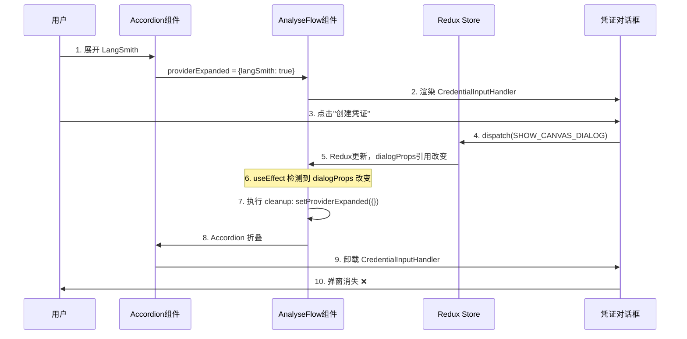

# Bug 修复文档：智能体配置中凭证弹窗立即消失问题

## 📋 问题描述

### 问题现象
在智能体的草稿列表中，按照以下步骤操作时会出现弹窗立即消失的问题：
1. 点击智能体详情
2. 点击右上角"配置"按钮
3. 切换到"分析聊天流"标签
4. 展开任意分析提供商（如 LangSmith、LangFuse 等）
5. 点击"连接凭证"的"创建"按钮
6. **弹窗会短暂出现，然后立即消失** ❌

### 对比现象
- ❌ **智能体配置中**：弹窗立即消失（有问题）
- ✅ **工作流配置中**：弹窗正常显示（无问题）

### 用户体验影响
- 无法创建新凭证
- 用户操作被中断
- 造成困惑和不良体验

---

## 🔍 问题分析

### 涉及的文件
```
packages/ui/src/ui-component/extended/AnalyseFlow.jsx
packages/ui/src/views/canvas/CredentialInputHandler.jsx
packages/ui/src/views/credentials/CredentialListDialog.jsx
packages/ui/src/views/credentials/AddEditCredentialDialog.jsx
```

### 组件层级关系
```
ChatflowConfigurationDialog (配置对话框)
  └─> AnalyseFlow (分析聊天流组件)
      └─> Accordion (折叠面板)
          └─> CredentialInputHandler (凭证输入处理器)
              ├─> CredentialListDialog (凭证列表对话框)
              └─> AddEditCredentialDialog (创建/编辑凭证对话框)
```

### 问题的触发链路



### 核心原因

#### 原因 1：过度的 useEffect cleanup
**问题代码：**
```javascript
useEffect(() => {
    if (dialogProps.chatflow && dialogProps.chatflow.analytic) {
        setAnalytic(JSON.parse(dialogProps.chatflow.analytic))
    }
    
    return () => {
        setAnalytic({})
        setProviderExpanded({})  // ⚠️ 问题：每次 dialogProps 改变都重置
    }
}, [dialogProps])  // dialogProps 对象引用频繁改变
```

**问题分析：**
- `dialogProps` 是对象引用，即使内容相同，引用改变就会触发 useEffect
- 当用户打开凭证对话框时，Redux 状态更新导致 `dialogProps` 引用改变
- useEffect 执行 cleanup 函数，调用 `setProviderExpanded({})`
- 所有 Accordion 被强制折叠
- 子组件 `CredentialInputHandler` 被卸载
- 对话框状态丢失，弹窗消失

#### 原因 2：条件渲染导致组件卸载
**问题代码：**
```javascript
<AccordionDetails>
    {provider.inputs.map((inputParam, index) => (
        <Box key={index}>
            {providerExpanded[provider.name] && inputParam.type === 'credential' && (
                <CredentialInputHandler />  // ⚠️ 依赖 providerExpanded
            )}
        </Box>
    ))}
</AccordionDetails>
```

**问题分析：**
- 当 `providerExpanded[provider.name]` 变为 `undefined` 时
- 条件渲染失败：`undefined && <CredentialInputHandler />` = `false`
- `CredentialInputHandler` 组件被从 DOM 中移除（卸载）
- 组件内部管理的所有状态（包括对话框状态）全部丢失

### React 基础知识补充

#### 1. useEffect 的执行时机
```javascript
useEffect(() => {
    // ① 组件挂载时执行
    // ② 依赖项改变时执行
    console.log('执行 effect')
    
    return () => {
        // ③ 下次 effect 执行前先执行这里（cleanup）
        // ④ 组件卸载时执行这里
        console.log('清理 effect')
    }
}, [依赖项])
```

**执行顺序示例：**
```
初始渲染：
  → 执行 effect

依赖项改变：
  → 执行 cleanup（清理旧的 effect）
  → 执行 effect（执行新的 effect）

组件卸载：
  → 执行 cleanup
```

#### 2. 对象引用与相等性
```javascript
const obj1 = { name: 'test' }
const obj2 = { name: 'test' }

console.log(obj1 === obj2)  // false（引用不同）

// 在 React 中
useEffect(() => {
    // 即使对象内容相同，只要引用不同就会触发
}, [dialogProps])  // dialogProps 是对象
```

#### 3. 条件渲染与组件生命周期
```javascript
// 场景 1：组件保持挂载
<div style={{ display: show ? 'block' : 'none' }}>
    <MyComponent />  // 组件始终存在，状态保留
</div>

// 场景 2：组件被卸载
{show && <MyComponent />}  // show=false 时组件被销毁，状态丢失
```

---

## 💡 解决方案

### 修复 1：移除过度的 cleanup 函数

**修改文件：** `packages/ui/src/ui-component/extended/AnalyseFlow.jsx`

**修改位置：** 第 292-304 行

**修改前：**
```javascript
useEffect(() => {
    if (dialogProps.chatflow && dialogProps.chatflow.analytic) {
        try {
            setAnalytic(JSON.parse(dialogProps.chatflow.analytic))
        } catch (e) {
            setAnalytic({})
            console.error(e)
        }
    }

    return () => {
        setAnalytic({})
        setProviderExpanded({})  // ❌ 问题代码
    }
}, [dialogProps])
```

**修改后：**
```javascript
useEffect(() => {
    if (dialogProps.chatflow && dialogProps.chatflow.analytic) {
        try {
            setAnalytic(JSON.parse(dialogProps.chatflow.analytic))
        } catch (e) {
            setAnalytic({})
            console.error(e)
        }
    }

    // ✅ 移除了 cleanup 函数
    // 让 providerExpanded 状态保持稳定，不会因为 dialogProps 改变而重置
}, [dialogProps])
```

**修复原理：**
- 移除了 cleanup 函数中的状态重置逻辑
- `providerExpanded` 状态只在用户点击 Accordion 时改变
- 不会因为 Redux 更新或 props 改变而被意外重置

### 修复 2：优化条件渲染和添加稳定 key

**修改文件：** `packages/ui/src/ui-component/extended/AnalyseFlow.jsx`

**修改位置：** 第 375-416 行

**修改前：**
```javascript
<AccordionDetails>
    {provider.inputs.map((inputParam, index) => (
        <Box key={index} sx={{ p: 2 }}>
            {/* ... */}
            {providerExpanded[provider.name] && inputParam.type === 'credential' && (
                <CredentialInputHandler
                    data={analytic[provider.name] ? { credential: analytic[provider.name].credentialId } : {}}
                    inputParam={inputParam}
                    onSelect={(newValue) => setValue(newValue, provider.name, 'credentialId')}
                />
            )}
        </Box>
    ))}
</AccordionDetails>
```

**修改后：**
```javascript
<AccordionDetails>
    {providerExpanded[provider.name] && provider.inputs.map((inputParam, index) => (
        <Box key={index} sx={{ p: 2 }}>
            {/* ... */}
            {inputParam.type === 'credential' && (
                <CredentialInputHandler
                    key={`${provider.name}-${inputParam.name}`}  // ✅ 添加稳定的 key
                    data={analytic[provider.name] ? { credential: analytic[provider.name].credentialId } : {}}
                    inputParam={inputParam}
                    onSelect={(newValue) => setValue(newValue, provider.name, 'credentialId')}
                />
            )}
        </Box>
    ))}
</AccordionDetails>
```

**修复原理：**
1. **条件渲染提升到 map 之前**
   - 只有展开的 Accordion 才渲染输入组件
   - 性能优化：折叠的 Accordion 不会渲染内部组件

2. **添加稳定的 key**
   - `key={`${provider.name}-${inputParam.name}`}` 为每个组件提供唯一标识
   - React 可以正确追踪和管理每个组件实例
   - 确保数据正确回显

### 为什么需要稳定的 key？

**没有 key 时 React 的行为：**
```javascript
// React 无法区分这些组件
<CredentialInputHandler />  // 这是哪个？
<CredentialInputHandler />  // 这是哪个？
<CredentialInputHandler />  // 这是哪个？

// 重新渲染时可能复用错误的组件实例
// 导致状态混乱和数据回显错误
```

**有稳定 key 时 React 的行为：**
```javascript
// React 明确知道每个组件的身份
<CredentialInputHandler key="langSmith-credential" />   // LangSmith 的凭证
<CredentialInputHandler key="langFuse-credential" />    // LangFuse 的凭证
<CredentialInputHandler key="lunary-credential" />      // Lunary 的凭证

// 重新渲染时正确复用对应的组件实例
// 状态和数据保持正确
```

---

## ✅ 修复效果

### 修复前的执行流程
```
1. 用户展开 LangSmith
   → providerExpanded = { langSmith: true }
   
2. 用户点击创建凭证
   → Redux 状态更新
   
3. dialogProps 对象引用改变
   → useEffect 被触发
   
4. 执行 cleanup 函数
   → setProviderExpanded({})
   → providerExpanded = {}
   
5. Accordion 折叠
   → providerExpanded[provider.name] = undefined
   
6. 条件渲染失败
   → undefined && <CredentialInputHandler /> = false
   
7. 组件卸载
   → CredentialInputHandler 从 DOM 移除
   
8. 对话框消失 ❌
```

### 修复后的执行流程
```
1. 用户展开 LangSmith
   → providerExpanded = { langSmith: true }
   
2. 用户点击创建凭证
   → Redux 状态更新
   
3. dialogProps 对象引用改变
   → useEffect 被触发
   
4. useEffect 执行（无 cleanup）
   → providerExpanded 保持 { langSmith: true }
   
5. Accordion 保持展开
   → providerExpanded[provider.name] = true
   
6. 条件渲染成功
   → true && <CredentialInputHandler /> = <CredentialInputHandler />
   
7. 组件保持挂载
   → CredentialInputHandler 继续存在
   
8. 对话框正常显示和操作 ✅
   
9. 用户选择凭证后
   → 数据正确回显 ✅
```

### 功能验证
- ✅ 弹窗不再消失
- ✅ 可以正常创建凭证
- ✅ 凭证数据正确回显
- ✅ Accordion 状态保持稳定
- ✅ 性能优化（只渲染展开的内容）

---

## 📚 知识点总结

### 1. useEffect cleanup 的使用时机
```javascript
useEffect(() => {
    // 设置副作用
    const subscription = api.subscribe()
    
    return () => {
        // cleanup 应该用于：
        // ✅ 清理订阅
        // ✅ 清理定时器
        // ✅ 清理事件监听
        // ✅ 取消网络请求
        
        // ❌ 不应该用于重置不相关的状态
        subscription.unsubscribe()
    }
}, [依赖项])
```

**最佳实践：**
- Cleanup 函数应该清理当前 effect 创建的资源
- 不要在 cleanup 中重置不相关的 UI 状态
- 考虑 cleanup 执行的时机和影响

### 2. 对象作为依赖项的问题
```javascript
// ❌ 不好的做法
useEffect(() => {
    // props 对象引用频繁改变
}, [props])

// ✅ 好的做法 1：只依赖需要的属性
useEffect(() => {
    // 只在 chatflow 实际改变时触发
}, [dialogProps.chatflow])

// ✅ 好的做法 2：使用 useMemo 稳定引用
const stableProps = useMemo(() => dialogProps, [
    dialogProps.chatflow?.id,
    dialogProps.chatflow?.analytic
])
```

### 3. 条件渲染的选择
```javascript
// 场景 1：需要保持状态，只是隐藏
<div style={{ display: show ? 'block' : 'none' }}>
    <ExpensiveComponent />
</div>

// 场景 2：不需要保持状态，可以销毁重建
{show && <SimpleComponent />}

// 场景 3：性能优化，但要保持状态
{show ? (
    <ExpensiveComponent />
) : (
    <Placeholder />  // 占位符保持位置
)}
```

### 4. React key 的重要性
```javascript
// ❌ 不稳定的 key
{items.map((item, index) => (
    <Component key={index} />  // index 在排序后会改变
))}

// ✅ 稳定的 key
{items.map(item => (
    <Component key={item.id} />  // 使用唯一 ID
))}

// ✅ 组合 key
<CredentialInputHandler 
    key={`${provider.name}-${inputParam.name}`}
/>
```

### 5. 状态管理的最佳实践
```javascript
// ✅ 状态应该：
// 1. 只在必要时更新
// 2. 由直接的用户操作触发
// 3. 避免副作用的级联更新

const [expanded, setExpanded] = useState({})

// 由用户操作直接触发
const handleAccordionChange = (name) => (event, isExpanded) => {
    setExpanded(prev => ({
        ...prev,
        [name]: isExpanded
    }))
}

// ❌ 避免在不相关的 effect 中重置
useEffect(() => {
    // ...其他逻辑
    setExpanded({})  // 不好！
}, [someProps])
```

---

## 🎓 给初学者的建议

### 调试此类问题的方法

1. **添加 console.log 追踪状态变化**
```javascript
useEffect(() => {
    console.log('dialogProps changed:', dialogProps)
    console.log('providerExpanded before:', providerExpanded)
    
    // ...逻辑代码
    
    return () => {
        console.log('cleanup: resetting providerExpanded')
        setProviderExpanded({})
    }
}, [dialogProps])
```

2. **使用 React DevTools**
   - 观察组件的挂载/卸载
   - 查看 props 和 state 的变化
   - 追踪重新渲染的原因

3. **理解组件生命周期**
   - 组件什么时候被创建？
   - 组件什么时候重新渲染？
   - 组件什么时候被销毁？

4. **对比正常和异常的场景**
   - 为什么工作流中正常？
   - 智能体中有什么不同？
   - 找出差异点

### 学习资源推荐

- [React 官方文档 - useEffect](https://react.dev/reference/react/useEffect)
- [React 官方文档 - 条件渲染](https://react.dev/learn/conditional-rendering)
- [React 官方文档 - 列表与 Key](https://react.dev/learn/rendering-lists)

---

## 📝 变更记录

| 日期 | 修改内容 | 修改文件 |
|------|---------|---------|
| 2025-10-23 | 移除过度的 useEffect cleanup 函数 | `AnalyseFlow.jsx` |
| 2025-10-23 | 优化条件渲染位置 | `AnalyseFlow.jsx` |
| 2025-10-23 | 为 CredentialInputHandler 添加稳定 key | `AnalyseFlow.jsx` |

---

## 🔗 相关问题

如果将来遇到类似问题，可以参考此文档的排查思路：
1. 检查是否有过度的 cleanup 函数
2. 检查对象引用作为依赖项的情况
3. 检查条件渲染导致的组件卸载
4. 确保组件有稳定的 key

---

**文档创建时间：** 2025-10-23  
**Bug 修复人员：** AI Assistant  
**文档维护者：** Development Team

